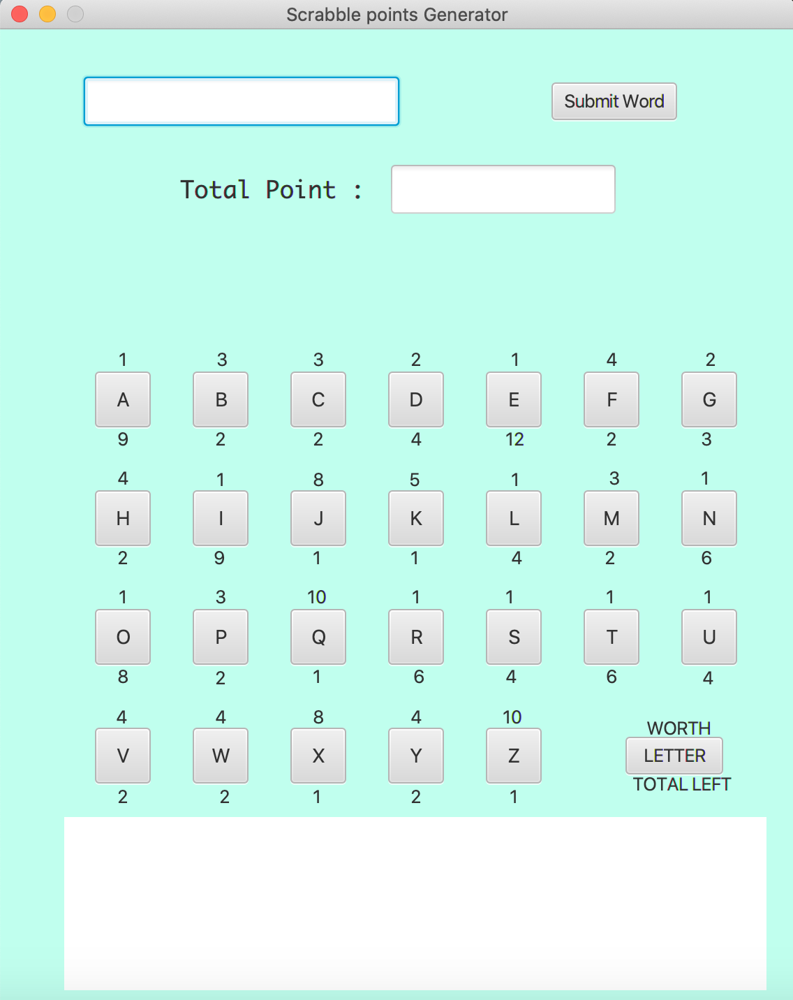
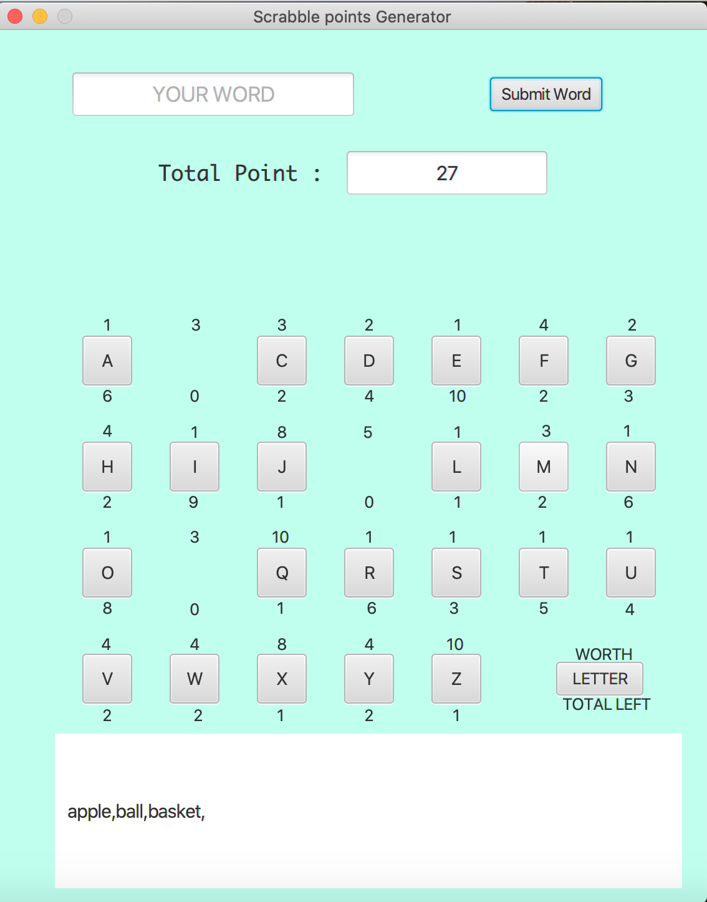

# Scrabble-Points-Generator Game
# Used JAVA for the Logic, followed MVC architecture
# Used Java-FXML for the Front-end
# Rules are each word must contain one vowel letter
# Words cannot be repeated

